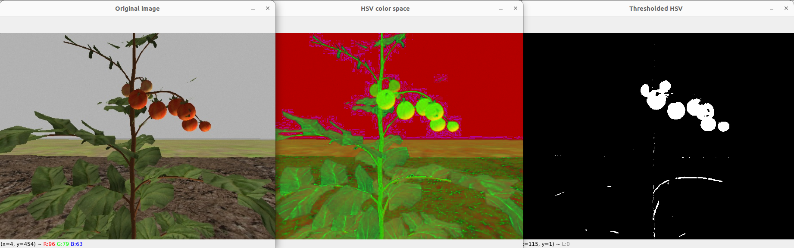
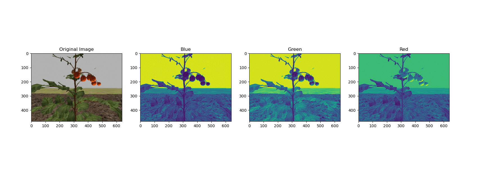

# PARC 2024 OpenCV Workshop Repository



## Instructions:

### Clone the repository
Place in same workspace as the original PARC Engineers League repository
```
cd ~/ros2_ws/src
git clone https://github.com/PARC-Robotics/opencv-workshop-2024.git
```

Or, to create a new package from scratch, run the following
```
ros2 pkg create --build-type ament_python opencv-workshop-2024 --dependencies rclpy std_msgs sensor_msgs cv_bridge image_transport opencv
```

### Install dependencies
In a terminal, run the commands
```
sudo apt-get install libopencv-dev python3-opencv
sudo apt-get install ros-humble-cv-bridge
```

### Compile

```
cd ~/ros2_ws
colcon build --packages-select opencv-workshop-2024
```

### Run Python scripts
In a terminal, run the commands
```
python basic_img_operations.py 
```



To use the color thresholding utility from [Najam Syed](https://github.com/nrsyed/computer-vision/tree/master/ColorThreshUtil) (slightly modified)
```
python colorthresh.py --image images/image1.jpg
```


### Run with ROS
In a terminal, run the commands
```
source ~/ros2_ws/install.setup.bash
ros2 launch parc_robot_bringup task2_launch.py
```

Open another terminal and run the following commands
```
source ~/ros2_ws/install.setup.bash
ros2 run opencv_workshop_2024 img_subscriber
```